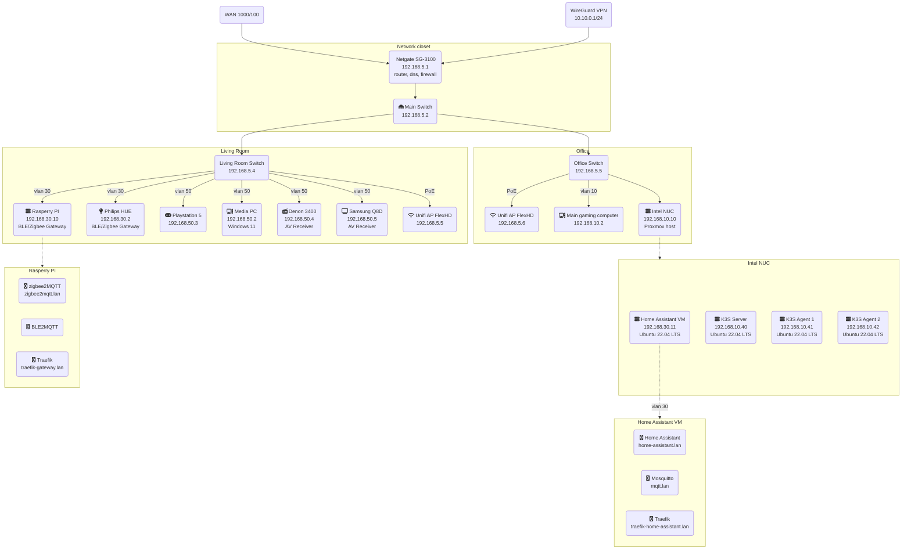
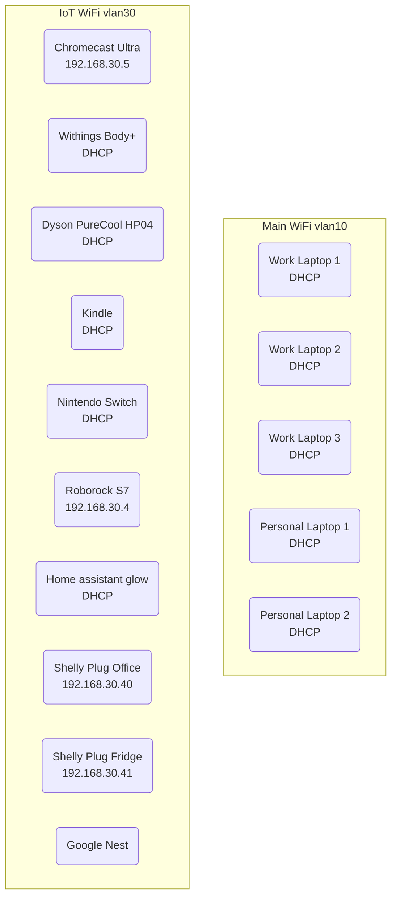
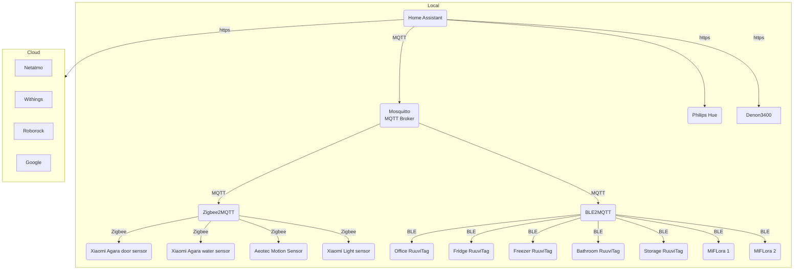

# Network

## Overview of network

### Current VLANs
- LAN 192.168.5.1/24
  - All the network equipment are here
- VLAN 10 Main 192.168.10.1/24
  - Trusted VLAN with access to everything
- VLAN 30 IoT 192.168.30.1/24
  - Cannot access anything but Internet and devices in same VLAN
- VLAN 50 Media 192.168.50.1/24
  - Cannot access anything but Internet and UPNP is allowed for certain devices
- VPN 10.10.0.1/24

### Overview of Firewall rules
- DNS everything else but 192.168.5.1 is blocked
  - All DNS calls are redirected here with NAT for VLAN 10, 30 and 50 + VPN
  - Some servers need to do DNS1 acme challenges -> they are allowed to access other DNS servers
  - PfBlocker blocks a lot of dns requests and Ips
- Traffic between VLANS is denied
  - Main VLAN can access everything
  - Also remote VP
  - Home assistant can access DENON 3400 in Media VLAN

### Network Diagram

### Wifi networks

### Home assistant
